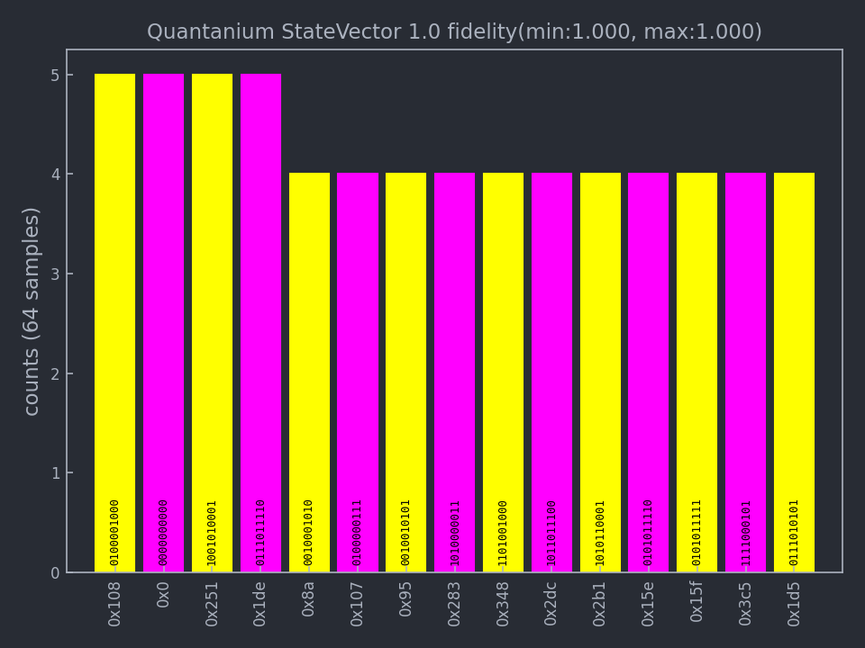

# QLEO (Quobly Logical Emulator Online): Python Interface for Quantum Circuits

Welcome to **QLEO**, a Python library designed for building, simulating, and analyzing quantum circuits powerd by **MIMIQ** emulator of **[QPerfect](https://qperfect.io/)**.

---

## Installation

Install the library directly from the Quobly GitHub repository:

```bash
pip install qleo
```

### Optional Dependencies

To enable visualization feature, ensure you install:

```bash
pip install qleo[visualization]
```

---

## Getting Started

Start by importing the `qleo` library. This library provides tools for creating, manipulating, and simulating quantum circuits.

1. **Import the Library**

    By using `from qleo import *`, you gain access to all classes and methods required for quantum circuit operations.

    ```python

    from qleo import *
    ```

2. **Create and Manipulate Circuits**
   In this step, you create a quantum circuit with `Circuit()` and add gates to it.
    `Hadamard Gate (GateH)`: Places each qubit in a superposition state.
    `Controlled-Z Gate (GateCZ)`: Introduces entanglement between qubits by applying a phase shift if both qubits are in the |1⟩ state.

    ```python
    n = 10
    c = Circuit()
    c.push(GateH(), range(n))
    c.push(GateCZ(), range(n-1), range(1,n))
    c.push(GateCZ(), 0, n-1)
    ```

3. **Execute** & **Get Result**
   Here, you execute the circuit on **QuoblySimulator** (`Simulates the quantum circuit using a state vector approach`) and retrieve the result.

    ```python
    processor = Qleo()
    result = processor.execute(c, nsamples=1000)

    print(result)
    ```

    The result contains detailed information about the circuit execution:

    ```
    QCSResults:
    ├── simulator: Quantanium StateVector 1.0
    ├── timings:
    │    ├── apply time: 0.000318101s
    │    └── sample time: 0.000277592s
    ├── fidelity estimate: 1
    ├── average multi-qubit gate error estimate: 0
    ├── most sampled:
    │    ├── bs"0100001000" => 5
    │    ├── bs"0000000000" => 5
    │    ├── bs"1001010001" => 5
    │    ├── bs"0111011110" => 5
    │    └── bs"0010001010" => 4
    ├── 1 executions
    ├── 0 amplitudes
    └── 1000 samples
    ```

    The output provides a summary of your simulation results, including key information about the backend used, execution details, and measurement outcomes. You'll find details such as the simulator type, timings for circuit execution and measurement, fidelity estimates, and the most frequently observed quantum states. Additionally, it includes the total number of samples and any specific execution metrics for analyzing the performance and accuracy of your quantum circuit.

4. **Get Histogram of the samples**
   The `result.histogram()` method generates a counts distribution of the sampled measurement outcomes.

    ```python
    result.histogram()
    ```

5. **Visualizing the results**
   To visualize the results of your quantum circuits, you can use the `plothistogram` function provided by the `qleo.visualization` module.

   **Example**

    ```python
    from qleo.visualization import plothistogram
    plothistogram(result)
    ```

    

---

## Documentation

The **Quobly Framework** is based on **MIMIQ** by **QPerfect**. Comprehensive documentation, tutorials, and examples on how to build circuits with the **Quobly Framework** and **MIMIQ** are available at [docs.qperfect.io](https://docs.qperfect.io/). Please remember to substitute any occurrences of `mimiqcircuits` in the documentation with `quoblyframwork`. For example, in place of `from mimiqcircuits import *`, use `from qleo import *`.

---

## Contact

For issues, suggestions, or inquiries, reach out via:

- **Suggestions**: [contact (Quobly)](https://quobly.io/) or [contact (QPerfect)](https://qperfect/#contact) 
- **Email**: [support (QPerfect)](mailto:mimiq.support@qperfect.io)
